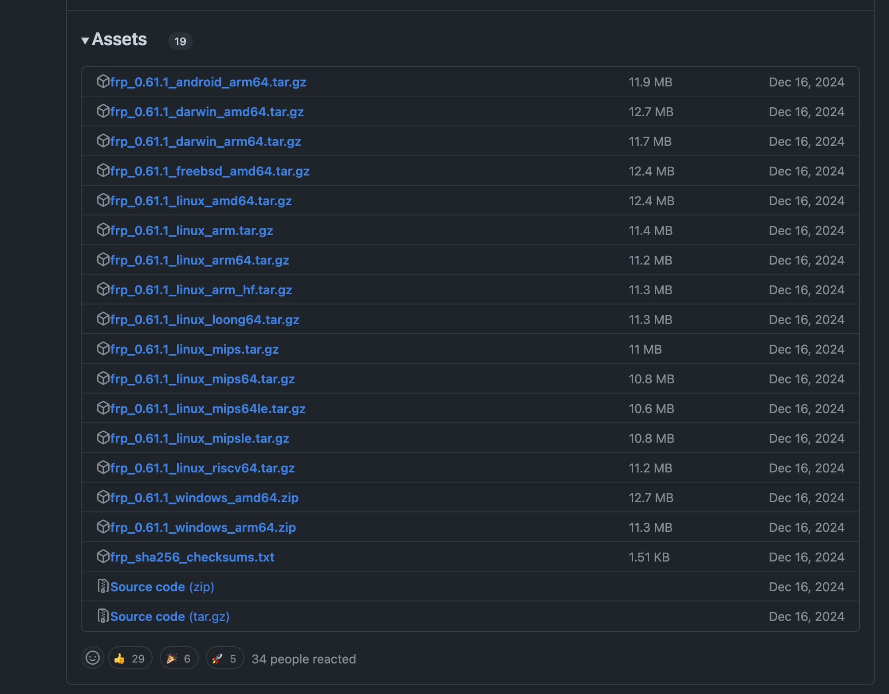
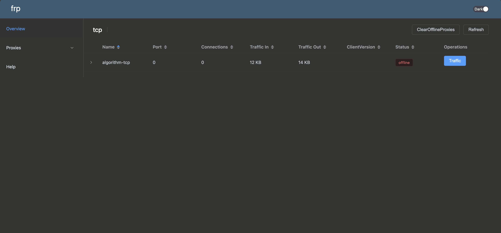
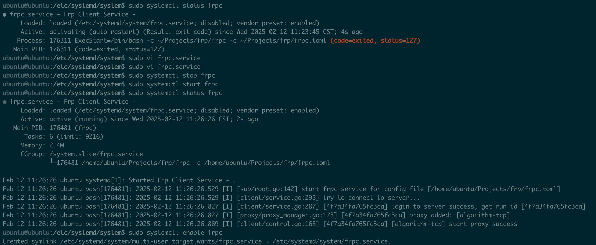

## frp是什么？

frp 是一个专注于内网穿透的高性能的反向代理应用，支持 TCP、UDP、HTTP、HTTPS 等多种协议。可以将内网服务以安全、便捷的方式通过具有公网 IP 节点的中转暴露到公网。

## 下载Frp

[Frp下载地址](https://github.com/fatedier/frp/releases)

下载 frpc 前，请先确认您的处理器架构。执行下面的命令，根据输出结果查表：

```linux
# 查看cpu架构
lscpu
```

| 输出  | 架构  |
|---|---|
| i386, i686  | i386 |
|  x86_64|amd64 |
| arm, armel  |armv7* |
| aarch64, armv8l  |arm64 |
| mips  |mips* |
| mips64  | mips64* |



## 服务器端(云服务)

1. 将下载后的文件解压并进入到解压后的文件夹

```linux
tar zxvf frp_0.61.1_linux_amd64.tar.gz
```

2. 编辑文件夹中`frps.toml`文件

```txt
bind_port = 8050
# 客户端需要配置对应的token才允许映射
authentication_method = "token"
token="xxxx"
# 接收http请求
vhost_http_port = 8051

#仅允许服务器上的指定端口/端口范围 避免滥用端口
allow_ports = 7700-7710

# 仪表盘配置
# The default value is 127.0.0.1. Change it to 0.0.0.0 when you want to access it from a public network.
dashboard_addr = "0.0.0.0"
dashboard_port = 8052
# dashboard's username and password are both optional
dashboard_user = "admin"
dashboard_password = "admin"

log_file = ./frps.log
log_level = info
log_max_days = 3

```

3. 启动服务

```linux
./frps -c ./frps.toml
```

4. 可进入仪表盘查看详细情况

>http://ip+8052



## 客户端

### 操作流程

1. 将下载后的文件解压并进入到解压后的文件夹

```linux
tar zxvf frp_0.61.1_linux_amd64.tar.gz
```

2. 编辑文件夹中`frpc.toml`文件

```txt
serverAddr = "你的服务器ip"
serverPort = 8050
auth.token = "wHs84C8SIEHJbDoSUx7usz7sM2GQwoHls5eLiWPowuGVvoKsCIZK6sCZVoMVhM9p"

[[proxies]]
name = "algorithm-ssh"
type = "tcp"
localIP = "127.0.0.1"
# 本机需要映射的端口
localPort = 22
# 映射到云服务器的哪个端口
remotePort = 7701

[[proxies]]
name = "algorithm-tcp"
type = "tcp"
localIP = "127.0.0.1"
# 本机需要映射的端口
localPort = 8080
# 映射到云服务器的哪个端口
remotePort = 7702

```

3. 启动服务

```linux
./frpc -c ./frpc.toml
```

4. 浏览器访问对应端口验证

> http://云服务器ip:remotePort

### 自启动

客户端启动完后，需要设置一下开机自动启动，不然每次重启都要手动启动。

1. 进入到存放开机自启文件的路径

```linux
cd /etc/systemd/system
```

2. 新建名为frpc的.service文件

```linux
sudo vim frpc.service
```

3. 编辑自动文件

```linux
[Unit]
Description=Frp Client Service - %i
After=network.target syslog.target
Wants=network.target

[Service]
Type=simple
Restart=on-failure
RestartSec=5s
ExecStart=/bin/bash -c '/home/ubuntu/Projects/frp/frpc -c /home/ubuntu/Projects/frp/frpc.toml'

[Install]
WantedBy=multi-user.target
```

4. 设置服务

* 开机自启

```linux
sudo systemctl enable frpc
```

* 启动服务

```linux
sudo systemctl start frpc.service
```

* 检查服务状态

```linux
sudo systemctl status frps.service

```

